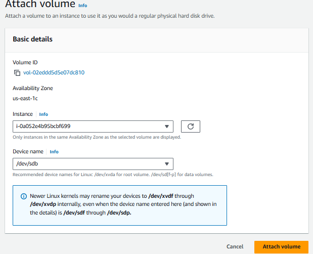
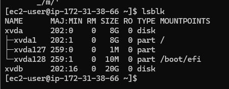
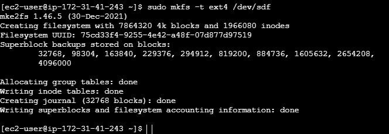
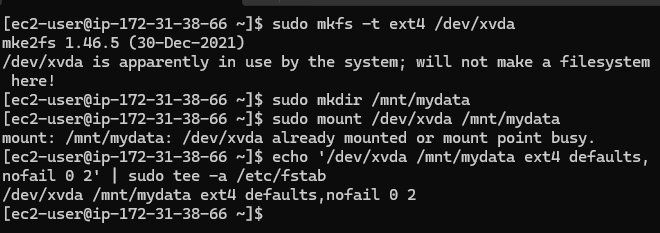
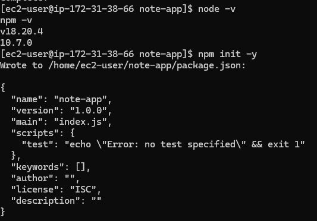
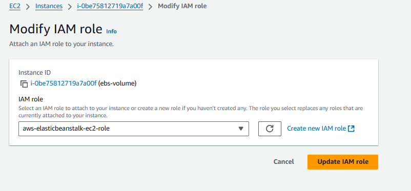

* Creating a real-time application that uses AWS Elastic Block Store (EBS) 
* volumes involves integrating the EBS with a running application on an EC2 instance, 
* typically managed through Elastic Beanstalk (EBS). 
* Here's a guide to set up a simple application that utilizes EBS for storage and can perform real-time tasks.

### Project Overview: Real-Time Data Processing Application Using AWS EBS

* We'll create a Node.js application that reads and writes data to an EBS volume, allowing real-time interaction. 
* The example will involve a simple text-based note-taking application.

##### Prerequisites

- AWS account
    - AWS CLI installed and configured
    - Elastic Beanstalk Command Line Interface (EB CLI) installed
    - Basic knowledge of Node.js

#### Step-by-Step Guide

##### Step 1: Create and Attach an EBS Volume

1. **Log in to the AWS Management Console** and navigate to the EC2 dashboard.

    * Create an `EC2 Instance`

     

#### What is EBS:

* Amazon Elastic Block Store (Amazon EBS) is an easy-to-use, scalable, high-performance block-storage service designed for Amazon Elastic Compute Cloud (Amazon EC2).

2. **Create an EBS Volume:**
   - Go to `Volumes` in the left sidebar.
   - Click `Create Volume`
   - Select 
        - `Volume type`
            - SSD-based volumes
                - General Purpose SSD (gp2)
                - General Purpose SSD (gp3)
                - Provisioned IOPS SSD (io1)
                - Provisioned IOPS SSD (io2)
            - HDD-based volumes
                - Cold HDD(sc1)
                - Throughput Optimized HDD(st1)
                - Magnetic (standard)
        - `Size(GiB)`(Min: 1 GiB, Max: 16384 GiB)
        - `IOPS`(The requested number of I/O operations per second that the volume can support. It is applicable to Provisioned IOPS SSD (io1) and General Purpose SSD (gp2 and gp3) volumes only.)
        - `Throughput`(MiB/s)
        - **Availability Zone** (`select AZ = EC2 instance AZ which instance you want to attach your volume`)
        - Snapshot ID - optional
        - Encryption
        - Tags - optional 

   - Click `Create Volume`

         

3. **Attach the EBS Volume to an EC2 Instance:**

   - Right-click the newly created volume and select `Attach Volume`
   - Choose the instance from the list and click `Attach`

        
        

4. **Log into your EC2 instance via SSH.**

   ```bash
   ssh -i your-key.pem ec2-user@<your-instance-public-dns>
   ```

5. **Format and mount the EBS volume:**

   * Check available disks:

     ```bash
     lsblk
     ```
     

   - Format the volume (replace `/dev/xvdf` with your volume device):

     ```bash
     sudo mkfs -t ext4 /dev/sdf
     ```
     

   - Create a mount point and mount the volume:

     ```bash
     sudo mkdir /mnt/mydata
     sudo mount /dev/sdf /mnt/mydata
     ```
6. **Ensure the volume is mounted on reboot:**

   - Add to `/etc/fstab`:

     ```bash
     echo '/dev/sdf /mnt/mydata ext4 defaults,nofail 0 2' | sudo tee -a /etc/fstab
     ```
     

##### Step 2: Set Up Your Node.js Application

1. **Create a new directory for your project:**
   ```bash
   mkdir note-app
   cd note-app
   ```

2. **Initialize a new Node.js project:**
   ```bash
   sudo yum update -y
   
   sudo yum install -y nodejs

   node -v
   npm -v

   npm init -y
   ```
   

3. **Install required packages:**
   ```bash
   npm install express body-parser fs
   ```
    

4. **Create the server:**
   - Create a file named `server.js`:
     ```javascript
     const express = require('express');
     const bodyParser = require('body-parser');
     const fs = require('fs');
     const path = require('path');

     const app = express();
     const PORT = process.env.PORT || 3000;
     const DATA_FILE = '/mnt/mydata/notes.txt'; // Path to EBS volume

     app.use(bodyParser.json());
     app.use(express.static('public'));

     app.get('/notes', (req, res) => {
         fs.readFile(DATA_FILE, 'utf8', (err, data) => {
             if (err) {
                 return res.status(500).send('Error reading notes');
             }
             res.send(data);
         });
     });

     app.post('/notes', (req, res) => {
         const note = req.body.note;
         fs.appendFile(DATA_FILE, note + '\n', (err) => {
             if (err) {
                 return res.status(500).send('Error saving note');
             }
             res.send('Note saved');
         });
     });

     app.listen(PORT, () => {
         console.log(`Server is running on port ${PORT}`);
     });
     ```

5. **Create a simple HTML client:**
   - Create a directory named `public`, and inside it create an `index.html` file:
     ```html
     <!DOCTYPE html>
     <html>
     <head>
         <title>Real-Time Notes</title>
     </head>
     <body>
         <h1>Notes</h1>
         <div id="notes"></div>
         <textarea id="note" placeholder="Write a note..."></textarea>
         <button id="save">Save Note</button>

         <script>
             const notesDiv = document.getElementById('notes');
             const noteInput = document.getElementById('note');

             function loadNotes() {
                 fetch('/notes')
                     .then(response => response.text())
                     .then(data => {
                         notesDiv.textContent = data;
                     });
             }

             document.getElementById('save').onclick = function() {
                 const note = noteInput.value;
                 fetch('/notes', {
                     method: 'POST',
                     headers: {
                         'Content-Type': 'application/json'
                     },
                     body: JSON.stringify({ note })
                 }).then(() => {
                     noteInput.value = '';
                     loadNotes();
                 });
             };

             loadNotes(); // Load notes on page load
         </script>
     </body>
     </html>
     ```

##### Step 3: Create the Elastic Beanstalk Application

1. **Initialize Elastic Beanstalk:**

   * For using elastic beanstalk, we need to install `EB CLI`

   ```bash
   sudo yum update -y

   sudo yum install -y python3 python3-pip

   # Initialize Your Elastic Beanstalk Application
   # After installing the EB CLI, you can initialize your application:

   pip3 install awsebcli --upgrade --user

   echo 'export PATH=$PATH:~/.local/bin' >> ~/.bashrc 
   source ~/.bashrc
   
   eb --version

   cd ~/note-app

   # you have to configure aws for using elastic beanstalk.

   eb init -p node.js note-app

   ```
   Replace `node.js-14` with the version you want to use.

   
   


2. **Create an environment and deploy:**
   ```bash
   eb create note-app-env

   or 

   aws elasticbeanstalk create-environment --application-name note-app --environment-name note-application-env --solution-stack-name "64bit Amazon Linux 2 v5.0.2 running Node.js 12" --option-settings Namespace=aws:autoscaling:launchconfiguration,OptionName=InstanceProfile,Value=beanstalkinstance --option-settings Namespace=aws:autoscaling:launchconfiguration,OptionName=RootVolumeType,Value=gp2

   eb status

   eb logs

   eb health

   ```
   

   
   
   

   In the above images the process was failed to lack of permissions, So after giving certain permissions like below you need to perform again.
   
    - create role  with name `aws-elasticbeanstalk-service-role` and  attach permissions 
        - `AWSElasticBeanstalkEnhancedHealth`
        - `AWSElasticBeanstalkManagedUpdatesCustomerRolePolicy`
        - `iam:PassRole`

    - add role to EC2 Instance

        
        
        ```
        # iam:PassRole

            {
        "Version": "2012-10-17",
        "Statement": [
            {
            "Effect": "Allow",
            "Action": "iam:PassRole",
            "Resource": "arn:aws:iam::<YOUR_ACCOUNT_ID>:role/aws-elasticbeanstalk-service-role"
            }
        ]
        }
        ```

3. **Deploy your application:**

   ```bash
   eb deploy
   ```

##### Step 4: Access Your Application

1. After deployment, the EB CLI will give you a URL to access your application.

2. Open a web browser and navigate to the provided URL. You should see your note-taking application.

##### Step 5: (Optional) Configure Monitoring and Scaling

You can adjust your environment settings to enable load balancing, scaling, and monitoring through the Elastic Beanstalk console.

##### Step 6: Cleanup

To avoid charges, terminate your environment after completing your project:

```bash
eb terminate note-app-env
```

which is useful for the deployment purpose and differenct 


You’ve created a simple real-time note-taking application using AWS EBS for storage,
allowing you to write and read notes persistently.
This setup illustrates how to integrate EBS with an application hosted on AWS Elastic Beanstalk.


### Manual Way for Elastic Beanstalk

### Step 1: Create Application 
