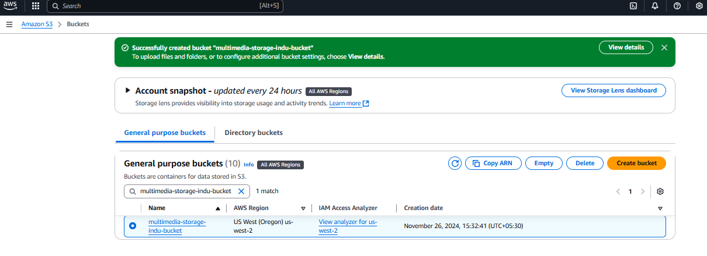

### Real-World Example

* Imagine a scenario where a media company needs to store high-resolution images and video content. 
* The images/ folder is used for frequently accessed images, while videos/ are archived after a certain period. 
* Content must be stored securely, with only authorized users able to access and manage files, while older files are automatically archived for cost efficiency.
Task Overview
* Participants will create an S3-based solution to store, organize, manage, and archive multimedia content (e.g., images, videos, documents). 
* They’ll learn to set up bucket configurations, use object versioning, implement lifecycle policies, and enforce security through bucket policies and access controls.

### Objectives

* Gain practical experience with S3 bucket creation, object storage, versioning, and lifecycle policies.
* Learn to secure data using bucket policies, encryption, and access control lists (ACLs).
* Understand cost optimization through storage class transitions and lifecycle management.
* Use S3 event notifications to simulate file management automation.

### Step-by-Step Task Instructions

1.	**Create an S3 Bucket with Appropriate Naming and Versioning**

    * Create a new **S3 bucket** named 

      - `multimedia-storage-[yourname]-bucket`

        

    * **Enable bucket versioning** to manage file versions and track changes over time
    
        
        

    * Upload a few files with the same name multiple times to test versioning. 

        

    * Observe how S3 maintains versions of each object.

        

2.	**Organize Files Using Prefixes (Folders)**

    * **Create a folder structure within the bucket. For instance:**

        *	images/
        *	videos/
        *	documents/

        
        

    * Upload several files into each "folder" and understand how prefixes work in S3 to simulate directory structures.

        

3.	**Implement Lifecycle Policies for Cost Optimization**

* Set up lifecycle policies for each folder to move objects to cost-effective storage classes over time:

    * **`Scenario 1`**: **Move objects in the images/ folder to S3 Standard-IA (Infrequent Access) after 30 days.**

       * **Using AWS Management Console**:
            * Open the S3 Console.
            * Select the `bucket` where `images/` is stored.
            * Go to the `Management tab`.
            * Click `Create lifecycle rule`.
            * Name the rule: ex: `ImagesToStandardIA`.
            * `Limit scope`: Specify prefix as images/.
            * `Transition to Standard-IA:`
                * Select Move to a different storage class.
                * Choose S3 Standard-IA.
                * Set 30 days after object creation.
            * Save the rule.

                
                
                

        * **Using AWS CLI**:
            * Create a JSON file (lifecycle-policy.json) with the following content:
            ```json
            {
            "Rules": [
                {
                "ID": "ImagesToStandardIA",
                "Prefix": "images/",
                "Status": "Enabled",
                "Transitions": [
                    {
                    "Days": 30,
                    "StorageClass": "STANDARD_IA"
                    }
                ]
                }
            ]
            }    
            ```
            ```
            aws s3api put-bucket-lifecycle-configuration --bucket my-bucket --lifecycle-configuration file://lifecycle-policy.json

            ```

    ***`Scenario 2:`** **Move objects in the videos/ folder to S3 Glacier after 60 days and delete them after 180 days.**

    * **Experiment with different configurations for archiving data based on folder and file type.**

    1. `File Types`: Use suffix filters in lifecycle rules.
        * Example: Transition all .jpg files in images/ to Standard-IA:
        ```json
        {
        "Rules": [
            {
            "ID": "ImagesJPGToStandardIA",
            "Filter": {
                "And": {
                "Prefix": "images/",
                "Tags": [],
                "Suffix": ".jpg"
                }
            },
            "Status": "Enabled",
            "Transitions": [
                {
                "Days": 30,
                "StorageClass": "STANDARD_IA"
                }
            ]
            }
        ]
        }
        ```
    2. `Multi-Transitions`: Combine multiple transitions.
        * `Example`: Transition objects in `data/` to Standard-IA after 30 days, Glacier after 90 days

        ```json
        {
        "Rules": [
            {
            "ID": "DataMultiTransitions",
            "Prefix": "data/",
            "Status": "Enabled",
            "Transitions": [
                {
                "Days": 30,
                "StorageClass": "STANDARD_IA"
                },
                {
                "Days": 90,
                "StorageClass": "GLACIER"
                }
            ]
            }
        ]
        }
        ```

    3. `Tagging-Based Rules`: Apply rules only to objects with specific tags.


    * **Document each lifecycle policy created and explain why it’s optimized for cost and access patterns.**

4.	**Enable Server-Side Encryption**

    * Apply server-side encryption to the bucket to secure data at rest.
    * Use S3 managed keys (SSE-S3) or AWS KMS keys (SSE-KMS).
    * Document the steps taken to enable encryption and the differences between SSE-S3 and SSE-KMS.
    
        

5.	**Configure Access Controls and Bucket Policie**

    * Create a bucket policy that grants read access to a specific IAM role or user.

        

        ```json
        {
        "Version": "2012-10-17",
        "Statement": [
            {
            "Effect": "Allow",
            "Action": "s3:GetObject",
            "Resource": "arn:aws:s3:::multimedia-storage-indu-bucket/*",
            "Principal": {
                "AWS": "arn:aws:iam::640168439831:role/MyIAMRole"
            }
            }
        ]
        }
        ```
        
        


    * Add an Access Control List (ACL) to give specific permissions to selected users or groups.


        

    * Ensure that public access is blocked (unless specified) to prevent unintended exposure.

        

    * Review the policy and understand how permissions are defined and restricted.

6.	**Set Up S3 Event Notifications for File Management Automation**

    * Configure the bucket to send event notifications on specific events, such as `s3:ObjectCreated:* or s3:ObjectRemoved:*`
    * Route notifications to an Amazon SNS topic or email to simulate automation for file management.
    * Upload and delete files in the bucket, observing notifications for each action.
    
* **Step 1**: Create an Amazon SNS Topic:

    * Navigate to the `Amazon SNS` console.
    * Click Topics → Create `topic`.
    * Choose `Standard` type.
    * Enter a name for the topic (e.g., FileManagementNotifications).
    * Click `Create topic`.

    


* **Step 2**: Subscribe to the SNS Topic
    * Open the topic you just created in the SNS console.
    * Click `Create subscription`.
    * Set Protocol to Email (or another option like Lambda or HTTP for other integrations).
    Enter your Email Address (or endpoint for your integration).
    * Click `Create subscription`.
    * `Confirm` the subscription by clicking the link in the confirmation email sent to the address you provided.

    
    

* **Step 3**: Configure S3 Event Notifications
Navigate to the Amazon S3 console.

    * Open the `bucket` you want to monitor.
    * Go to the `Properties` tab and scroll to the `Event notifications` section.
    * Click `Create event notification`:
        * `Name`: Provide a name for the event notification (e.g., ObjectCreatedNotification).
        * `Event types`: Select events (e.g., `All object create events` or `All object delete events`).
        * `Destination`: Choose SNS topic and select the topic you created (FileManagementNotifications).

    * before  Saving  changes,

        * go to SNS Topic 
        * Go to Access policy and give access to s3 bucket using below policy and save changes.

        ```json
        {
        "Version": "2012-10-17",
        "Statement": [
            {
            "Effect": "Allow",
            "Principal": {
                "Service": "s3.amazonaws.com"
            },
            "Action": "SNS:Publish",
            "Resource": "arn:aws:sns:us-west-2:640168439831:S3-SNS",
            "Condition": {
                "ArnLike": {
                "aws:SourceArn": "arn:aws:s3:::multimedia-storage-indu-bucket"
                }
            }
            }
        ]
        }
        ```

    * Save changes in S3 event notification and after creation you will get like below

        

* **Step 4**: Test the Setup

    * Upload a file:
        * Go to your S3 bucket.
        * Click Upload and add a file.

            
            

        * Monitor your email (or SNS subscriber endpoint) for a notification about the upload.
            
             
        
    * Delete a file:
        * In the S3 bucket, select the file.
        * Click Delete and confirm.
        * Monitor for a notification about the deletion.

            
            
            
            

7.	**Implement Cross-Region Replication (Optional)**
    * Set up Cross-Region Replication (CRR) to duplicate data from your primary bucket to a secondary bucket in another AWS region.
    * Make sure versioning is enabled on both buckets and create IAM policies that permit replication.
    * Test the replication by uploading files to the primary bucket and verifying their presence in the secondary bucket.
    
### **If you want to retrive files which you deleted:**

* Make sure `Turn ON` -> Versioning
* Make sure `Turn OFF` -> Show Version 

* Now try by deleting any object,  Make sure `show version` is Turned `OFF`

    

* Delete any object (ex: Dockerflow.gif)

    
    
* Turn ON (show versions), you will see like below:

    

* Now, delete the '`Delete Maker`' to retrive the original object which you deleted

    
    

**Note**: you need to make sure 'Show Versions' Turn off for retriving any deleted files   


   
