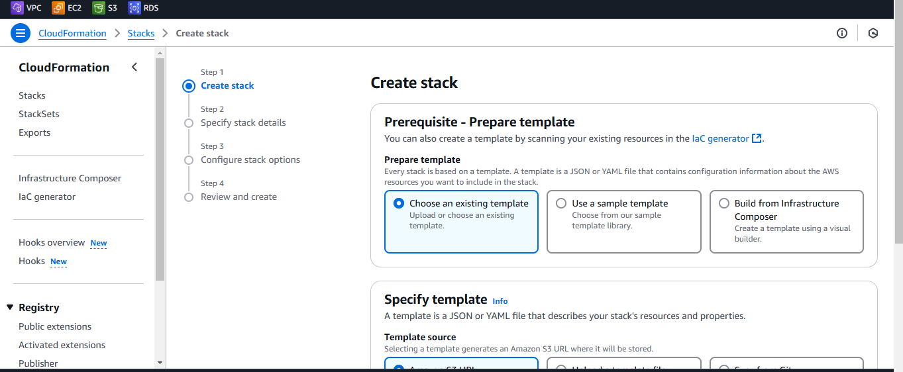
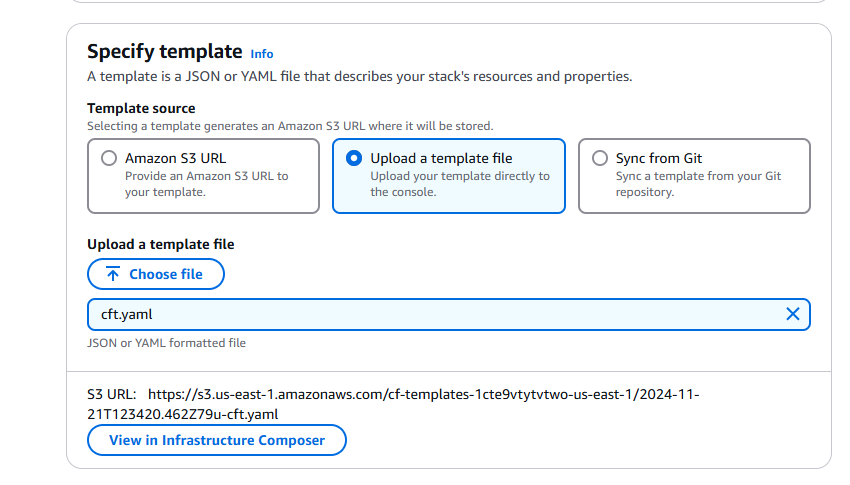
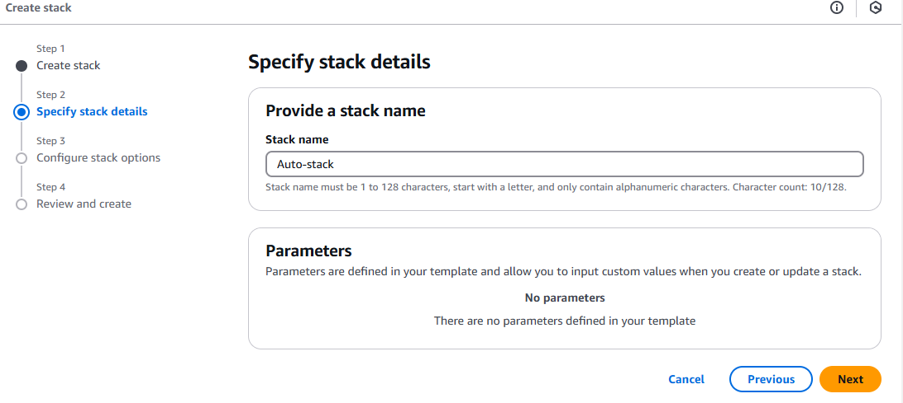
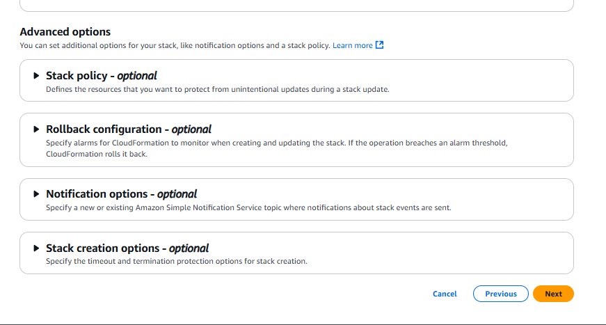
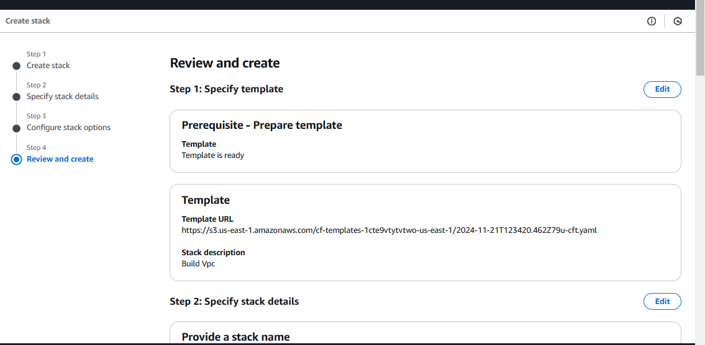
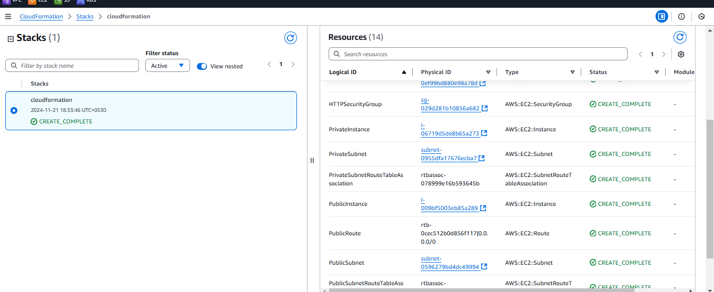

### AWS - CF - Task


##### Create the below listed resources, with AWS - Cloudformation!!

- Create VPC using cli
- create Pub and Pvt subnets
- create IGW
- Attach IGW to VPC
- Create Pub and PVT RT
- Attach Pub sub to Pub rt
- Attach Pvt Sub to Pvt rt
- Attach IGW to Pub RT

- Create Sg for ssh // http
- Create a Ec2 in Pub Sub
- Create a Ec2 in Pvt Sub 

### Task:

#### CloudFormation:

* Model and provision all your cloud infrastructure
* AWS CloudFormation provides a common language to describe and provision all the infrastructure resources in your environment in a safe, repeatable way.

#### How it works?

1) Code your infrastructure using the CloudFormation template language in the YAML or JSON format, or start from many available sample templates.
2) Use AWS CloudFormation via the browser console, command line tools, or APIs to create a stack based on your template code.
3) AWS CloudFormation provisions and configures the stacks and resources you specified in your template.

#### Template

Before using below template change AMI-ID, Keypair, and as per your required region name

```yaml
AWSTemplateFormatVersion: '2010-09-09'

Resources:
  CFVPC:
    Type: AWS::EC2::VPC
    Properties:
      CidrBlock: 10.0.0.0/16
      EnableDnsSupport: true
      EnableDnsHostnames: true
      Tags:
        - Key: Name
          Value: myvpc

  PublicSubnet:
    Type: AWS::EC2::Subnet
    Properties:
      VpcId: !Ref CFVPC
      CidrBlock: 10.0.1.0/24
      AvailabilityZone: "us-east-1b"
      Tags:
        - Key: Name
          Value: publicsubnet

  PrivateSubnet:
    Type: AWS::EC2::Subnet
    Properties:
      VpcId: !Ref CFVPC
      CidrBlock: 10.0.8.0/24
      AvailabilityZone: "us-east-1a"
      Tags:
        - Key: Name
          Value: privatesubnet

  CFIGW:
    Type: AWS::EC2::InternetGateway
    Properties:
      Tags:
        - Key: Name
          Value: intergateway

  AttachGateway:
    Type: AWS::EC2::VPCGatewayAttachment
    Properties:
      VpcId: !Ref CFVPC
      InternetGatewayId: !Ref CFIGW

  CFPUBRT:
    Type: AWS::EC2::RouteTable
    Properties:
      VpcId: !Ref CFVPC
      Tags:
        - Key: Name
          Value: publicrt

  CFPVTRT:
    Type: AWS::EC2::RouteTable
    Properties:
      VpcId: !Ref CFVPC
      Tags:
        - Key: Name
          Value: privatert

  PublicSubnetRouteTableAssociation:
    Type: AWS::EC2::SubnetRouteTableAssociation
    Properties:
      SubnetId: !Ref PublicSubnet
      RouteTableId: !Ref CFPUBRT

  PrivateSubnetRouteTableAssociation:
    Type: AWS::EC2::SubnetRouteTableAssociation
    Properties:
      SubnetId: !Ref PrivateSubnet
      RouteTableId: !Ref CFPVTRT

  PublicRoute:
    Type: AWS::EC2::Route
    DependsOn: AttachGateway
    Properties:
      RouteTableId: !Ref CFPUBRT
      DestinationCidrBlock: "0.0.0.0/0"
      GatewayId: !Ref CFIGW

  # Security Groups
  SSHSecurityGroup:
    Type: AWS::EC2::SecurityGroup
    Properties:
      GroupDescription: "Enable SSH access"
      VpcId: !Ref CFVPC
      SecurityGroupIngress:
        - IpProtocol: "tcp"
          FromPort: 22
          ToPort: 22
          CidrIp: "0.0.0.0/0"
      Tags:
        - Key: Name
          Value: "SSHSecurityGroup"

  HTTPSecurityGroup:
    Type: AWS::EC2::SecurityGroup
    Properties:
      GroupDescription: "Enable HTTP access"
      VpcId: !Ref CFVPC
      SecurityGroupIngress:
        - IpProtocol: "tcp"
          FromPort: 80
          ToPort: 80
          CidrIp: "0.0.0.0/0"
      Tags:
        - Key: Name
          Value: "HTTPSecurityGroup"

  PublicInstance:
    Type: AWS::EC2::Instance
    Properties:
      InstanceType: "t2.micro"
      SubnetId: !Ref PublicSubnet
      ImageId: "ami-012967cc5a8c9f891"  # Make sure the AMI is correct for your region
      SecurityGroupIds:
        - !Ref SSHSecurityGroup
        - !Ref HTTPSecurityGroup
      KeyName: "cft"  # Ensure this key pair exists
      Tags:
        - Key: Name
          Value: "Pubinstance"

  PrivateInstance:
    Type: AWS::EC2::Instance
    Properties:
      InstanceType: "t2.micro"
      SubnetId: !Ref PrivateSubnet
      ImageId: "ami-012967cc5a8c9f891"  # Make sure the AMI is correct for your region
      SecurityGroupIds:
        - !Ref SSHSecurityGroup
      KeyName: "cft"  # Ensure this key pair exists
      Tags:
        - Key: Name
          Value: "Privateinstance"
```












