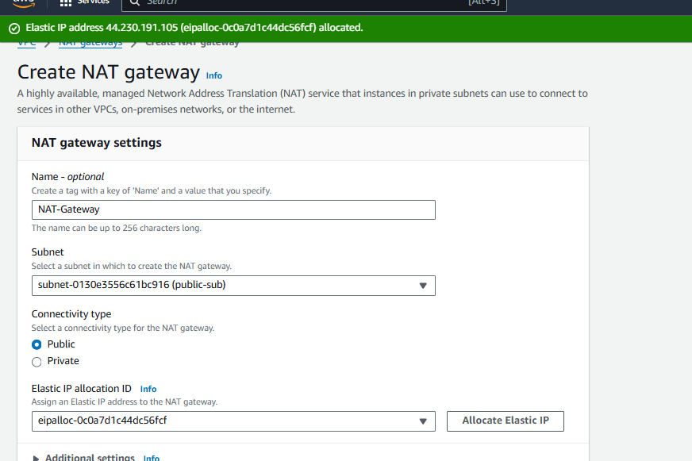
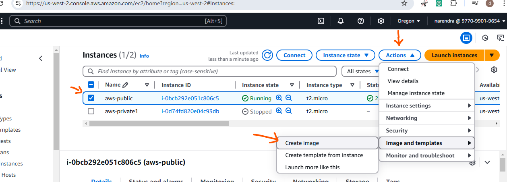
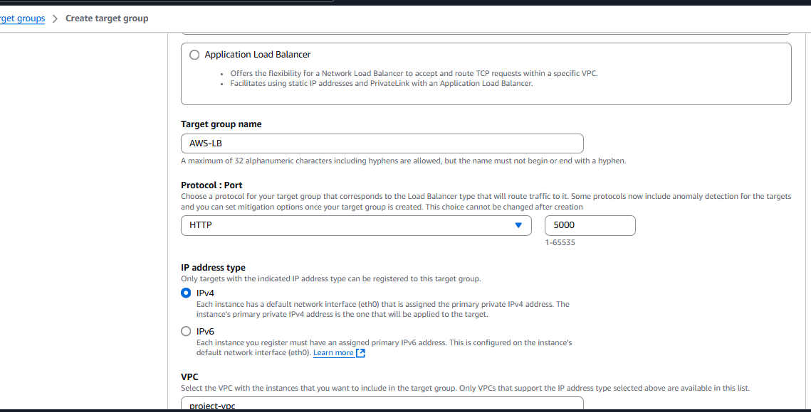
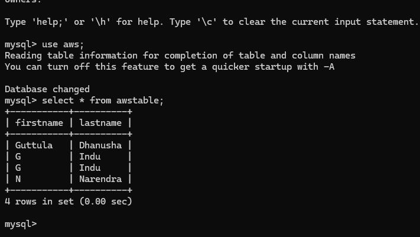
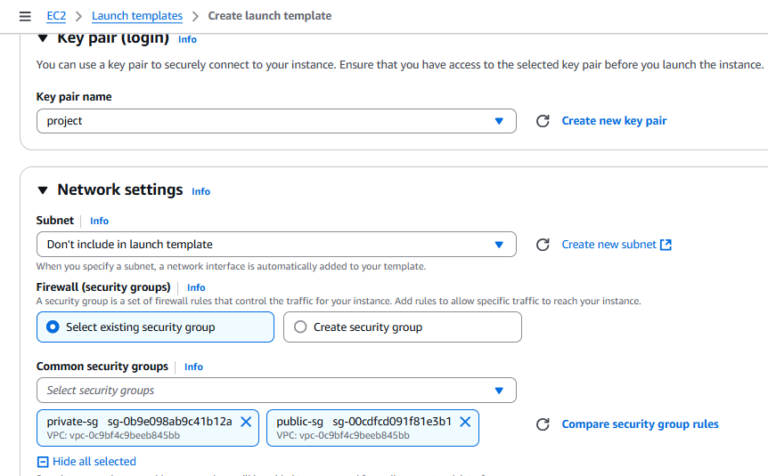
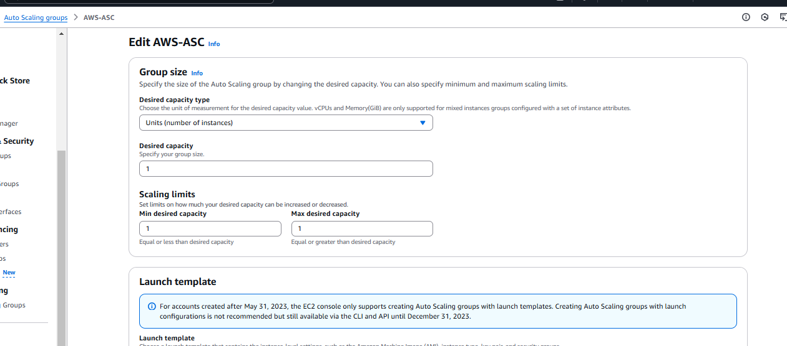
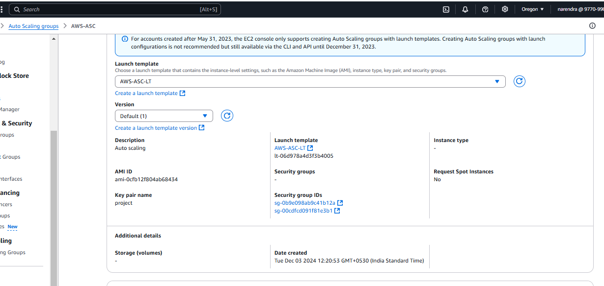
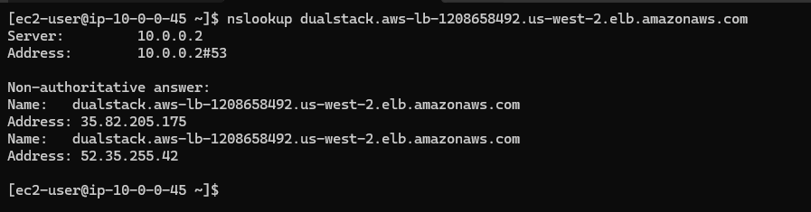

## Resources

- VPC
- S3
- IAM
- EC2
- LB
- CW/SNS
- RDS
- AS
- Hosting - Vm Deploy App - Addr ? IP - LB-DNS - Custom Domain Name !!! Where ?? DNS Provider - Go daddy / aligator / hostinger - AWS - Route53 

### Requirement 

#### Steps:

- Create VPC with /16 range
- Create IGW for VPC
- Create Two Subnets
- Pub and Pvt
- Pub Should have 4k Ip's
- Pvt Should Have 256 Ip's

- Create 3 servers across diff subnets.
- These servers are used for running application
- Create a DB - using RDS


- CODE For the Project - https://github.com/Ai-TechNov/On-Premise-Deployement.git

- Create 3 ec2 instance across Pvt-Subnets
- Deploy Above mentioned python code on the ec2's
- Create and Integrate RDS - DB within the code across all the 3 ec2. 
- As the app is running on PVT, it should be accessible via www !!
- The DB should be purely Pvt, and access should remian strictly to the admin !!

- For the Above infra, i want load-balancing to be configured.
- I want  Auto scaling for the 3 ec2's in order to avoid FT.
- These instances should be monitored and notificaitons should be in place !!

- Finally, The routing should happen via, ROUTE-53 using a Custom domain !

- IF any users browses the CDN, it should reach to app, where the app should collect user info and store it to the DB.
But, i want all the infra to be deployed in pvt-resources !! 


## Task

### 1. Initial Setup

* Prerequisites:

    * AWS account.
    * CLI tools installed (aws-cli, boto3).
    * Python codebase (from the GitHub repository).
    * SSH key pair to access EC2 instances.

* **AWS Networking Setup**:

    * Create a VPC with CIDR (ex: 10.0.0.0/16).

		

    * Create private subnets (10.0.21.0/24, 10.0.22.0/24, 10.0.23.0/20) in different availability zones for fault tolerance.
    * Create a public subnet (10.0.0.0/20) for the load balancer.

		

	* Create Route Table for Public RT and Private RT
    	* Configure Internet Gateway (IGW) and Attach Public subnet to the Public RT

			
			
			
			
		
    	* Configure NAT Gateway in the public subnet to allow private subnets to access the internet for updates.
			

		* Attach NAT Gateway and private subnets to Private RT 
			
			
		
	* Finally VPC - Resource map
		
			
### 2. EC2 Instances Setup

* Launch EC2 Instances, as we need 1 Public and 3 Private  Inatnces

	* First Create one public ec2 instance 

		
		
		
	
	* Launch instance 
		

1) Transfer pem file from local to EC2 Instance server
	```sh
	scp -i project.pem project.pem ec2-user@35.09.206.38:~
	```
2) Login into server check it is pem file transfered or not
		


3) Do installation and configuration

		```bash
		sudo yum update

		sudo mkdir /app1

		cd /app1

		pip3 install flask gunicorn

		pip3 install flask_mysqldb

		which gunicorn

		gunicorn --version

		sudo chown -R ec2-user:ec2-user /app1

		touch app1.log

		sudo chmod 644 /app1/app1.log

		# create main.py  for application

		sudo vim main.py

		from flask import Flask
		app = Flask(__name__)
		@app.route("/app1")
		def hello():
			return "Hello Dhanu from App1"

		# create web server

		sudo vim wsgi.py
		
		from main import app as application
		app=application
		if __name__ == '__main__':
			app.run(host='0.0.0.0',port=5001)

		sudo vim /etc/systemd/system/app1.service

		[Unit]
		Description=gunicorn daemon
		After=network.target
		[Service]
		User=ec2-user
		Group=ec2-user
		WorkingDirectory=/app1
		Environment="PATH=/home/ec2-user/.local/bin:/usr/bin:/bin"
		ExecStart=/home/ec2-user/.local/bin/gunicorn --access-logfile=/app1/app1.log --bind=0.0.0.0:5000 wsgi

		[Install]
		WantedBy=multi-user.target

		cd /app1

		# if necessery check port is running locally or not 

		sudo firewall-cmd --zone=public --add-port=5000/tcp --permanent

		sudo firewall-cmd --reload

		sudo iptables -L
		
		sudo netstat -tuln | grep 5000

		sudo systemctl daemon-reload
		sudo systemctl start app1
		sudo systemctl enable app1
		sudo systemctl status app1

		# Till here check is application is working or not. If working continue below process
		```

* If application running, you will get like below

		
	
* After getting page like above, continue below process for database creation 

	* Go to RDS, Follow below steps for RDS creation:

	1) Create Subnet Group

		
		
		
		

	2) Create Database and select subnet group which is previously you created

		
		
		
		

	* Later do installation of mysql server in EC2 Instance

		```bash
		cd /app1 

		sudo vim /etc/yum.repos.d/mysql.repo

		[mysql57-community]
		name=MySQL 5.7 Community Server
		baseurl=http://repo.mysql.com/yum/mysql-5.7-community/el/6/$basearch/
		enabled=1
		gpgcheck=0
		gpgkey=file:///etc/pki/rpm-gpg/RPM-GPG-KEY-mysql-2022

		cd /app1 

		sudo yum install -y mariadb-devel gcc* redhat-rpm-config python3-devel python3-pip nginx  
		
		mkdir templates/

		cd templates/
		
		sudo vi index.html

		<HTML>
		<BODY bgcolor="pink">
		<form method="POST" action="">
		<center>
		<H1>Enter your details </H1> <br>
				firstname <input type = "text" name= "fname" /> <br>
				lastname <input type = "text" name = "lname" /> <br>
		<input type = "submit">
		</center>
		</form>
		</BODY>
		</HTML>

		# Created RDS for our application and before that  install mysql server locally

		sudo yum -y install mysql-server
		sudo wget https://dev.mysql.com/get/mysql57-community-release-el7-11.noarch.rpm
		sudo rpm -ivh mysql57-community-release-el7-11.noarch.rpm
		sudo yum-config-manager --enable mysql57-community
		sudo yum clean all
		sudo yum makecache fast
		sudo yum -y install mysql-community-server
		sudo rpm --import https://repo.mysql.com/RPM-GPG-KEY-mysql-2022
		sudo yum clean all
		sudo yum makecache fast
		sudo yum -y install mysql-community-server
		sudo rpm -qa gpg-pubkey
		service mysqld start
		sudo service mysqld start
		sudo service mysqld status
		mysql --version

		# After Database creation use endpoint as host -h in below
		
		# check if mysql installed or not

		mysql --version

		sudo mysql -u admin -h <endpoint> -p
	
			create database <dbname>;
			use <dbname>;
			create table <tablename> (firstname varchar(30), lastname varchar (30));

		cd /app1

		# modify main.py with the below code

		sudo vi main.py
		
		from flask import Flask, render_template, request
		from flask_mysqldb import MySQL
		app = Flask(__name__, template_folder='/app1/templates/')

		app.config['MYSQL_HOST'] = '<db-endpoint>'
		app.config['MYSQL_USER'] = 'admin'
		app.config['MYSQL_PASSWORD'] = '<dbpassword>'
		app.config['MYSQL_DB'] = '<dbname>'
		mysql = MySQL(app)

		@app.route('/app3', methods=['GET', 'POST'])
		def index():
			if request.method == "POST":
				details = request.form
				firstname = details['fname']
				lastname = details['lname']
				cur = mysql.connection.cursor()
				cur.execute("INSERT INTO <tablename> (firstname, lastname) VALUES (%s, %s)", (firstname, lastname))
				mysql.connection.commit()
				cur.close()
				return 'success'
			return render_template('index.html')
		
	
		cd /app1

		ls

		sudo systemctl daemon-reload
		sudo systemctl start app1
		sudo systemctl enable app1
		sudo systemctl status app1
		```
		
		
		
		
		

* Till now database Created and Integrate with RDS. Successfully inserted data.

### 3. Create AMI:

* Creating Image is used avoid repititions for all above steps which we did till database process.

* So, Image creation for EC2 instance is one of the best way for time saving

* Steps:
	1) Goto Intance > Select Instance > Actions > Image and Templates > Create Image

		

	2) Select Create Image

		

### 4. Create 3 EC2 private instance using above created AMI

1)  Goto `EC2` Instance
	* Select `Launch Instance`
		* Name
		* Select Instance type
		* Select Key pair
		* Select My Own AMI 
		* Edit Networking > Select your `VPC` > select private `subnet` > IP `Disable` 
		* Create Security Group
		* Review and create instance
	
		
		

	* Same like above select private subnets and AMI, create remaining private instances

		
	
### 5. How to Connect Private Instance through Public Instance 

* Steps:

	1) Transfer Key Pair from Local to Remote EC2 Instance 
	```bash
	scp -i project.pem project.pem ec2-user@<ip_address>:~

	or

	scp -i ./project.pem ./project.pem ec2-user@<ip_address>:~
	```
	2) First login public instance and check for key pair and give permission to key pair

		

	3) Next, login into server using SSH

		


### 4. Application Accessibility using Load Balancer

* Load Balancer

	
	

* Setup Application Load Balancer (ALB):

	* Create `Target Groups`
	* Create an ALB in the public subnet and private subnet.
	* Configure target groups to include the EC2 instances.
	* Configure a listener for HTTP (80).
	* Attach the ALB security group to allow HTTP traffic.

		
		
		
		
		
		
	
	* Successfully Load Balancer created
		
		
	
	* Health Checks:
		* Configure health checks for the ALB to ensure only healthy instances receive traffic.
		
		
			
	* Check ALB DNS is working or not 

		
		
		
	
* Domain Name:

	* Use Route 53 to create a DNS record (e.g., www.yourdomain.com) pointing to the ALB.

### 5.  Auto Scaling 

* **Steps**:

1) Create Launch Template:

* Create a launch template with the desired configuration:
	* `Instance type`: t2.micro or t3.medium or t3.large.
	* `AMI`: Amazon Linux 2 or Ubuntu 22.04.
	* `Security group`:
		* Allow SSH (22) from your IP for access.
		* Allow inbound traffic from the Load Balancer's security group for ports required by the app (ex: 80).
	* `Auto Scaling`:
		* Desired capacity: 3 instances.
		* Minimum: 2, Maximum: 3 (adjust based on load).
		* Health check type: EC2 or ELB.

		
		
		
		

2) Create Auto Scaling group

* Select Template, already Existing Load Balancer, and set few more settings

	
	

* Scaling Policies:
	* Define scaling policies in Auto Scaling based on CPU usage or memory thresholds.

	
	
	
	
	
	

3) After creating Auto scaling, you can check ec2 instance which is automatically creating instance

	
	
	

* If you deleted instance also, it will automatically create another instance.
	

### 6. Create Domain Name using Route 53 for our application

1) Create Hosted Zone

	
	
	

2) Create Record in Hosted Zone

	
	


### 5. Monitoring and Notifications

* CloudWatch Monitoring:

	* Set up monitoring for:
		* EC2 instances (CPU, memory, disk).
		* RDS (connections, queries).
		* Create CloudWatch alarms for metrics (e.g., high CPU utilization).
		* Configure SNS for notifications (e.g., email, SMS).

	* Logging:
		* Enable CloudWatch Logs for the application and RDS.

### 7. Final Details

* Access the application via the domain name (www.yourdomain.com).
* Test database connections and ensure only admin has direct RDS access.
* Simulate load to verify Auto Scaling and Load Balancing.
* Public Subnet:
	* Application Load Balancer.
	* NAT Gateway.
* Private Subnets:
	* 3 EC2 instances running the Python application.
	* RDS instance.


